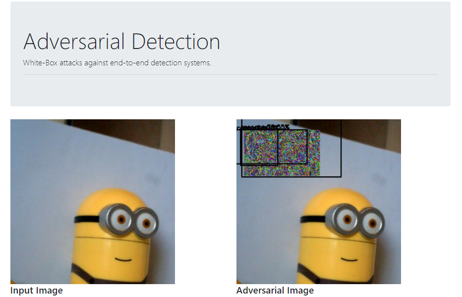

## Adversarial Detection

> Attacking Object Detection Systems in Real Time

[[ Talk ]](https://detection.wuhanstudio.uk) [[ Video ]](https://youtu.be/zJZ1aNlXsMU) [[ Paper ]](https://arxiv.org/abs/2209.01962) [[ Code ]](https://github.com/wuhanstudio/adversarial-detection)

### Overview

Generating adversarial patch is as easy as **drag and drop**.



### Quick Start

You may use [anaconda](https://www.continuum.io/downloads) or [miniconda](https://conda.io/miniconda.html). 

```
$ git clone https://github.com/wuhanstudio/adversarial-detection
$ cd adversarial-detection

$ # CPU
$ conda env create -f environment.yml
$ conda activate adversarial-detection

$ # GPU
$ conda env create -f environment_gpu.yml
$ conda activate adversarial-gpu-detection

$ python detect.py --model model/yolov3-tiny.h5 --class_name coco_classes.txt
```

The web page will be available at: http://localhost:9090/

That's it!

## Adversarial ROS Detection

We also tested our attacks in ROS Gazebo simulator. 

https://github.com/wuhanstudio/adversarial-ros-detection

[](https://github.com/wuhanstudio/adversarial-ros-detection)

## Citation

```
@misc{han2022detection,
  doi = {10.48550/ARXIV.2209.01962},
  url = {https://arxiv.org/abs/2209.01962},
  author = {Wu, Han and Yunas, Syed and Rowlands, Sareh and Ruan, Wenjie and Wahlstrom, Johan}, 
  title = {Adversarial Detection: Attacking Object Detection in Real Time},
  publisher = {arXiv},
  year = {2022},
}
```
