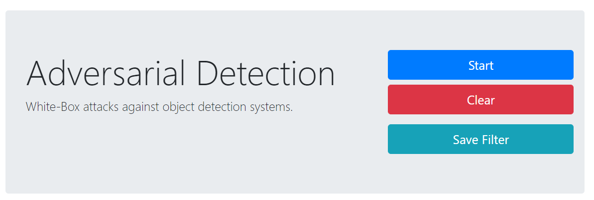

## Adversarial Detection

> Real-time adversarial attacks against Object Detection.




### Quick Start

You may use [anaconda](https://www.continuum.io/downloads) or [miniconda](https://conda.io/miniconda.html). 

```
$ conda env create -f environment.yml
$ conda activate adversarial-detection
$ python detect.py --model model/yolov3-tiny.h5 --class_name coco_classes.txt
```

The web page will be available at: http://localhost:9090/

That's it!
