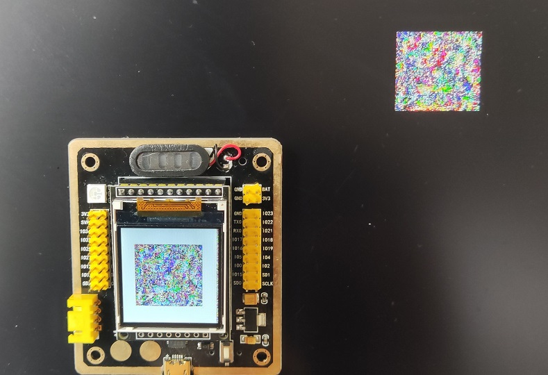

## Display the patch on remote screen

- `camera.py` reads images from the camera and publish to socketio.

- linux-fb displays the patch on linux framebuffer (/dev/fb0).
- esp32-st7735 displays the patch on ESP32 with ST7735 TFT LCD.



### Display on Linux Framebuffer (HDMI)

```
$ cd linux-fb
$ # Upload arm-linux.py to your linux client
$ # On your linux client
$ python3 arm-linux.py --ip 192.168.199.100 --port 9090
```

### Display on ESP32 (micropython)

```
$ git submodule init
$ git submodule update
$ cd esp32-st7735
$ # Upload esp32_server.py to your esp32 micropython client
$ # On your PC
$ python socketio2esp32.py --ip 192.168.199.142 --port 9191
```


